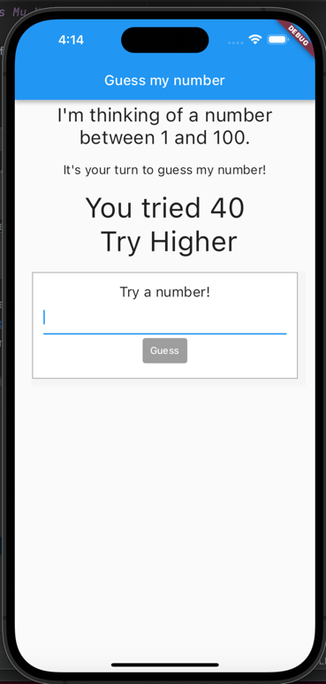
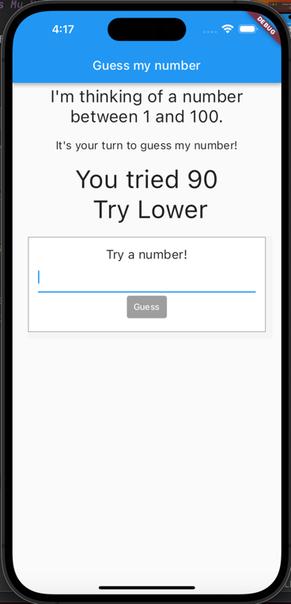
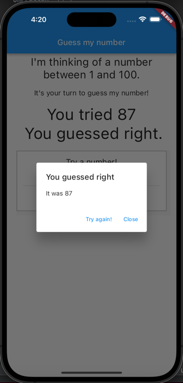
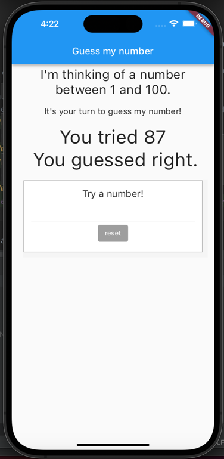

# homework 3 - Guess My Number

Simple flutter app for guessing a number between 1 and 100

## Getting Started

This project allows the user to play a simple game of guess my number.

When the app starts, a game will automatically be available for the user.

The flow of the game:
- User starts to guess the number by tiping it into the text field
  - 
- After writing a number, the user can press the guess button to see if they guessed the number. If not, they will be informed if the number is smaller or greater
  - 
  - 
- If the user guesses the correct number, a pop-up will appear informing them accordingly, offering as well to play again or to close
  - 
- If the user chooses to close, the pop-up will close and the game won't be available until the user presses the reset button
  - 

For help getting started with Flutter development, view the
[online documentation](https://docs.flutter.dev/), which offers tutorials,
samples, guidance on mobile development, and a full API reference.
